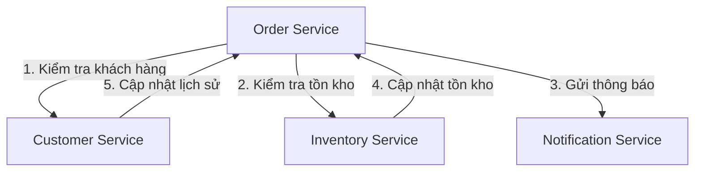
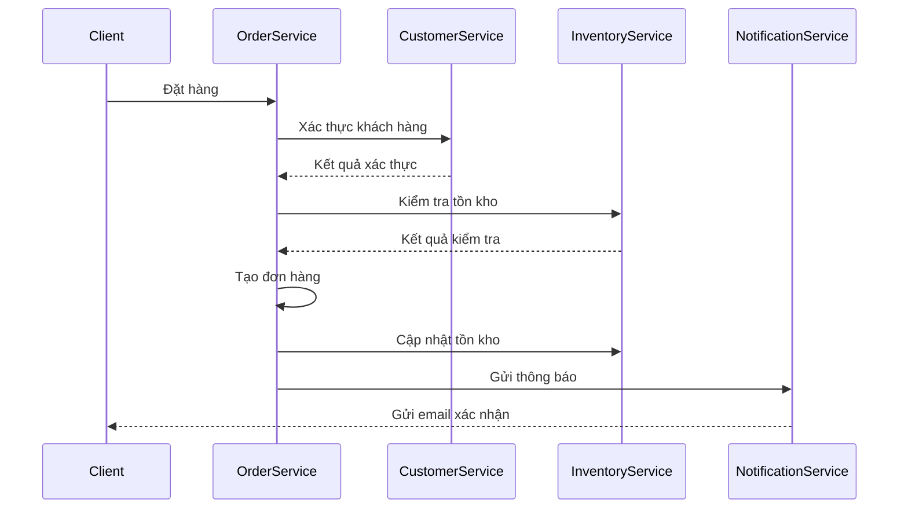
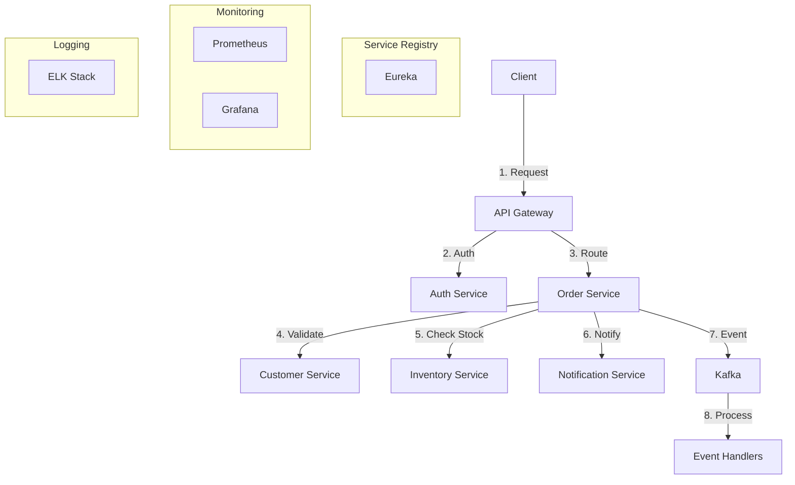

# 📊 Microservices System - Analysis and Design

## 1: Các bước thiết kế dịch vụ trong kiến trúc hướng dịch vụ (SOA)

Bước 1: Phân tách quy trình nghiệp vụ

Bước 2: Loại bỏ các hành động không phù hợp

Bước 3: Xác định các dịch vụ thực thể (Entity Service Candidates)

Bước 4: Xác định logic riêng của quy trình

Bước 5: Xác định tài nguyên

Bước 6: Gắn kết khả năng dịch vụ với tài nguyên và phương thức

Bước 7: Áp dụng hướng dịch vụ (Apply Service-Orientation)

Bước 8: Xác định các dịch vụ phối hợp (Composition Candidates)

Bước 9: Phân tích yêu cầu xử lý

## 2: Case Study: Hệ thống Thương mại Điện tử

### Vấn đề:
Công ty thương mại điện tử áp dụng kiến trúc SOA để tích hợp các hệ thống quản lý sản phẩm, đơn hàng, giỏ hàng và thông báo.
Trọng tâm là xây dựng các dịch vụ thực thể (Entity Services) để quản lý toàn bộ quy trình mua sắm từ khi khách hàng xem sản phẩm đến khi hoàn thành đơn hàng.
Yêu cầu:

  - Triển khai hệ thống với khả năng mở rộng cao để đáp ứng lượng người dùng lớn
  - Sử dụng Docker container và Kubernetes để đảm bảo khả năng mở rộng và triển khai linh hoạt
  - Hệ thống phải đảm bảo tính nhất quán dữ liệu giữa các dịch vụ, xử lý giao dịch đúng đắn và gửi thông báo kịp thời

### Giải pháp:
Nhóm kiến trúc SOA mô hình hóa quy trình Thương mại Điện tử sử dụng các dịch vụ REST, chia thành các dịch vụ chính:

  - *Product Service – Quản lý sản phẩm (GET/POST /products)*
    - Quản lý thông tin sản phẩm, danh mục, giá cả
  - *Cart Service – Quản lý giỏ hàng (GET/POST /cart)*
    - Xử lý thêm/xóa sản phẩm vào giỏ hàng
  - *Order Service – Quản lý đơn hàng (GET/POST /orders)*
    - Xử lý tạo và quản lý đơn hàng
  - *Inventory Service – Quản lý kho (GET/POST /inventory)*
    - Kiểm tra và cập nhật số lượng sản phẩm trong kho
  - *Customer Service – Quản lý khách hàng (GET/POST /customers)*
    - Quản lý thông tin và lịch sử mua hàng của khách hàng
  - *Notification Service – Gửi thông báo (POST /notifications)*
    - Gửi thông báo qua email và các kênh khác

#### Các bước hiện tại: 

# Thiết kế dịch vụ trong kiến trúc hướng dịch vụ (SOA) - Nghiệp vụ Đặt hàng

## Bước 1: Phân tách quy trình nghiệp vụ Đặt hàng
1. Bắt đầu nhận đơn đặt hàng khi khách hàng chọn sản phẩm và xác nhận mua hàng
2. Kiểm tra người dùng: xác minh tài khoản và quyền hạn khách hàng
3. Nhận thông tin khách hàng (tên, địa chỉ, liên hệ…)
4. Nhận thông tin sản phẩm (tên sản phẩm, số lượng…)
5. Kiểm tra tính hợp lệ của yêu cầu đặt hàng (số lượng, thời gian giao hàng…)
6. Kiểm tra kho: xác minh còn đủ số lượng sản phẩm không
7. Nếu không đủ số lượng, dừng quy trình và thông báo cho khách hàng
8. Nếu đủ số lượng, lưu đơn hàng vào database
9. Cập nhật lại số lượng sản phẩm trong kho
10. Xóa sản phẩm đã đặt khỏi giỏ hàng của khách hàng
11. Gửi email xác nhận đơn hàng thành công cho khách hàng

## Bước 2: Loại bỏ các hành động không phù hợp
- ~Bắt đầu nhận đơn đặt hàng khi khách hàng chọn sản phẩm và xác nhận mua hàng~
- ~Nhận thông tin khách hàng (tên, địa chỉ, liên hệ…)~
- ~Nhận thông tin sản phẩm (tên sản phẩm, số lượng…)~

Các bước còn lại:
- Kiểm tra người dùng: xác minh tài khoản và quyền hạn khách hàng
- Kiểm tra tính hợp lệ của yêu cầu đặt hàng (số lượng, thời gian giao hàng…)
- Kiểm tra kho: xác minh còn đủ số lượng sản phẩm không
- Nếu không đủ số lượng, dừng quy trình và thông báo cho khách hàng
- Nếu đủ số lượng, lưu đơn hàng vào database
- Cập nhật lại số lượng sản phẩm trong kho
- Xóa sản phẩm đã đặt khỏi giỏ hàng của khách hàng
- Gửi email xác nhận đơn hàng thành công cho khách hàng

*Phân tích:*
- Các bước bị loại bỏ là thao tác nhập liệu của người dùng, thuộc về giao diện hoặc client, không phải logic dịch vụ.
- Các bước còn lại là logic nghiệp vụ, có thể tự động hóa và đóng gói thành các dịch vụ thực thể (Order, Inventory, Cart, Notification, Customer).

## Bước 3: Xác định các dịch vụ thực thể (Entity Service Candidates)

### 1. Phân tích các thực thể chính trong nghiệp vụ đặt hàng:

#### 1.1. Thực thể Order (Đơn hàng)
- **Mục đích**: Lưu trữ thông tin đơn hàng
- **Thuộc tính chính**:
  - id: Định danh duy nhất (Long)
  - orderNumber: Mã đơn hàng (String)
  - customerId: Mã khách hàng (Long)
  - productId: Mã sản phẩm (Long)
  - quantity: Số lượng (Integer)
  - price: Giá (BigDecimal)
  - status: Trạng thái đơn hàng (String)
  - createdAt: Thời gian tạo (Date)
  - updatedAt: Thời gian cập nhật (Date)

#### 1.2. Thực thể Product (Sản phẩm)
- **Mục đích**: Quản lý thông tin sản phẩm
- **Thuộc tính chính**:
  - id: Định danh duy nhất (Long)
  - name: Tên sản phẩm (String)
  - skuCode: Mã SKU (String)
  - price: Giá (BigDecimal)
  - stock: Số lượng tồn kho (Integer)
  - description: Mô tả (String)

#### 1.3. Thực thể Customer (Khách hàng)
- **Mục đích**: Quản lý thông tin khách hàng
- **Thuộc tính chính**:
  - id: Định danh duy nhất (Long)
  - name: Tên khách hàng (String)
  - email: Email (String)
  - phone: Số điện thoại (String)
  - address: Địa chỉ (String)

### 2. Xác định các dịch vụ thực thể:

#### 2.1. Order Service
- **Mục đích**: Quản lý toàn bộ quy trình đặt hàng
- **Các chức năng chính**:
  1. Tạo đơn hàng mới
  2. Xác thực thông tin đơn hàng
  3. Cập nhật trạng thái đơn hàng
  4. Lấy thông tin đơn hàng
  5. Hủy đơn hàng

#### 2.2. Inventory Service
- **Mục đích**: Quản lý tồn kho sản phẩm
- **Các chức năng chính**:
  1. Kiểm tra số lượng tồn kho
  2. Cập nhật số lượng tồn kho
  3. Cảnh báo khi số lượng thấp
  4. Lấy thông tin tồn kho

#### 2.3. Customer Service
- **Mục đích**: Quản lý thông tin khách hàng
- **Các chức năng chính**:
  1. Xác thực thông tin khách hàng
  2. Lấy thông tin chi tiết khách hàng
  3. Cập nhật thông tin khách hàng
  4. Kiểm tra lịch sử mua hàng

#### 2.4. Notification Service
- **Mục đích**: Gửi thông báo cho khách hàng
- **Các chức năng chính**:
  1. Gửi email xác nhận đơn hàng
  2. Gửi thông báo trạng thái đơn hàng
  3. Gửi thông báo khi có vấn đề với đơn hàng

### 3. Mối quan hệ giữa các dịch vụ:



### 4. Luồng xử lý chính:

1. **Xác thực thông tin**:
   - Order Service gọi Customer Service để xác thực thông tin khách hàng
   - Order Service gọi Inventory Service để kiểm tra tồn kho

2. **Tạo đơn hàng**:
   - Order Service tạo đơn hàng mới
   - Order Service cập nhật trạng thái đơn hàng

3. **Cập nhật tồn kho**:
   - Order Service gọi Inventory Service để cập nhật số lượng tồn kho
   - Inventory Service xác nhận việc cập nhật

4. **Gửi thông báo**:
   - Order Service gọi Notification Service để gửi email xác nhận
   - Notification Service gửi thông báo cho khách hàng

### 5. Các điểm tích hợp:

1. **Giao tiếp đồng bộ**:
   - Sử dụng REST API với Feign Client
   - Giao tiếp trực tiếp giữa các service

2. **Giao tiếp bất đồng bộ**:
   - Sử dụng Kafka để xử lý sự kiện
   - Xử lý các tác vụ không cần phản hồi ngay lập tức

3. **Service Discovery**:
   - Sử dụng Eureka để quản lý và tìm kiếm service
   - Đảm bảo tính sẵn sàng của hệ thống

4. **API Documentation**:
   - Sử dụng OpenAPI/Swagger để tài liệu hóa API
   - Dễ dàng tích hợp và sử dụng

## Bước 4: Xác định logic riêng của quy trình

### Đánh giá khả năng tách thành dịch vụ (Service Capability Candidates)

#### 1. Xác thực thông tin khách hàng và kiểm tra tồn kho
- **Tính đặc thù quy trình**: 
  - Xác thực khách hàng là bước đầu tiên trong mọi giao dịch
  - Kiểm tra tồn kho là yêu cầu bắt buộc trước khi tạo đơn hàng
- **Tính độc lập**:
  - Customer Service có thể hoạt động độc lập, phục vụ nhiều nghiệp vụ khác
  - Inventory Service quản lý tồn kho riêng biệt, không phụ thuộc vào đơn hàng
- **Quyết định**: 
  - Giữ nguyên Customer Service và Inventory Service như các dịch vụ độc lập
  - Order Service sẽ gọi các service này thông qua REST API

#### 2. Tạo và quản lý đơn hàng
- **Tính đặc thù**:
  - Đây là nghiệp vụ cốt lõi của hệ thống
  - Bao gồm nhiều bước xử lý phức tạp
- **Tính nghiệp vụ**:
  - Cần đảm bảo tính nhất quán dữ liệu
  - Xử lý giao dịch (transaction) giữa nhiều service
- **Tách biệt trách nhiệm**:
  - Order Service chỉ tập trung vào quản lý đơn hàng
  - Không chứa logic xử lý tồn kho hay thông báo
- **Quyết định**:
  - Tách thành Order Service riêng biệt
  - Sử dụng Saga pattern để đảm bảo tính nhất quán dữ liệu

#### 3. Gửi thông báo xác nhận đơn hàng
- **Tính tái sử dụng cao**:
  - Có thể dùng cho nhiều loại thông báo khác nhau
  - Hỗ trợ nhiều kênh thông báo (email, SMS, push notification)
- **Tách biệt rõ ràng**:
  - Không liên quan đến logic xử lý đơn hàng
  - Chỉ chịu trách nhiệm gửi thông báo
- **Quyết định**:
  - Tách thành Notification Service riêng biệt
  - Sử dụng event-driven architecture để xử lý thông báo bất đồng bộ

### Phân tích chi tiết các dịch vụ:

#### 1. Order Service
- **Trách nhiệm chính**:
  - Tạo và quản lý đơn hàng
  - Điều phối luồng xử lý đơn hàng
  - Đảm bảo tính nhất quán dữ liệu
- **Các điểm tích hợp**:
  - Gọi Customer Service để xác thực
  - Gọi Inventory Service để kiểm tra tồn kho
  - Gửi event đến Notification Service

#### 2. Inventory Service
- **Trách nhiệm chính**:
  - Quản lý tồn kho sản phẩm
  - Cập nhật số lượng tồn kho
  - Cảnh báo khi số lượng thấp
- **Các điểm tích hợp**:
  - Cung cấp API cho Order Service
  - Gửi event khi số lượng thấp

#### 3. Customer Service
- **Trách nhiệm chính**:
  - Quản lý thông tin khách hàng
  - Xác thực thông tin đăng nhập
  - Quản lý lịch sử mua hàng
- **Các điểm tích hợp**:
  - Cung cấp API cho Order Service
  - Cập nhật lịch sử mua hàng

#### 4. Notification Service
- **Trách nhiệm chính**:
  - Gửi thông báo qua nhiều kênh
  - Quản lý template thông báo
  - Theo dõi trạng thái gửi thông báo
- **Các điểm tích hợp**:
  - Nhận event từ Order Service
  - Gửi thông báo qua các kênh khác nhau

### Sơ đồ tương tác giữa các dịch vụ:



## Bước 5: Xác định tài nguyên

### 1. List Functional Contexts (Liệt kê các ngữ cảnh chức năng)
*Ngữ cảnh chức năng chính:*
| Functional Context | Mô tả |
|-------------------|--------|
| Xác thực khách hàng | Kiểm tra thông tin và quyền hạn của khách hàng |
| Kiểm tra tồn kho | Xác minh số lượng sản phẩm có đủ để đáp ứng đơn hàng |
| Tạo đơn hàng | Tạo và lưu trữ thông tin đơn hàng mới |
| Cập nhật tồn kho | Giảm số lượng sản phẩm trong kho sau khi đặt hàng |
| Gửi thông báo | Gửi email xác nhận đơn hàng cho khách hàng |

### 2. Xác định và phân loại Resources
| Resource | Mô tả |
|----------|--------|
| Customer | Thông tin khách hàng và lịch sử mua hàng |
| Product | Thông tin sản phẩm và số lượng tồn kho |
| Order | Thông tin đơn hàng và chi tiết sản phẩm |
| Inventory | Quản lý số lượng tồn kho của sản phẩm |
| Notification | Quản lý và gửi thông báo cho khách hàng |

### 3. Mapping Business Entities to Resources
| Business Entity | Resource tương ứng |
|-----------------|-------------------|
| Customer | /api/customers |
| Product | /api/products |
| Order | /api/orders |
| Inventory | /api/inventory |
| Notification | /api/notifications |

## Bước 6: Gắn kết khả năng dịch vụ với tài nguyên và phương thức

### 1. Customer Service
| Resource | Method | Endpoint | Mô tả |
|----------|---------|-----------|--------|
| Customer | GET | /api/customers/{id} | Lấy thông tin khách hàng |
| Customer | POST | /api/customers/validate | Xác thực thông tin khách hàng |
| Customer | PUT | /api/customers/{id}/history | Cập nhật lịch sử mua hàng |

### 2. Product Service
| Resource | Method | Endpoint | Mô tả |
|----------|---------|-----------|--------|
| Product | GET | /api/products/{id} | Lấy thông tin sản phẩm |
| Product | GET | /api/products | Lấy danh sách sản phẩm |
| Product | PUT | /api/products/{id} | Cập nhật thông tin sản phẩm |

### 3. Order Service
| Resource | Method | Endpoint | Mô tả |
|----------|---------|-----------|--------|
| Order | POST | /api/orders | Tạo đơn hàng mới |
| Order | GET | /api/orders/{id} | Lấy thông tin đơn hàng |
| Order | PUT | /api/orders/{id}/status | Cập nhật trạng thái đơn hàng |

### 4. Inventory Service
| Resource | Method | Endpoint | Mô tả |
|----------|---------|-----------|--------|
| Inventory | GET | /api/inventory/{skuCode} | Kiểm tra tồn kho |
| Inventory | PUT | /api/inventory/{skuCode} | Cập nhật số lượng tồn kho |
| Inventory | GET | /api/inventory/{skuCode}/quantity | Lấy số lượng tồn kho |

### 5. Notification Service
| Resource | Method | Endpoint | Mô tả |
|----------|---------|-----------|--------|
| Notification | POST | /api/notifications/order-confirmation | Gửi email xác nhận đơn hàng |
| Notification | POST | /api/notifications/status-update | Gửi thông báo cập nhật trạng thái |
| Notification | GET | /api/notifications/history | Lấy lịch sử thông báo |

### Sơ đồ tương tác API:

```mermaid
graph TD
    A[Client] -->|1. POST /api/orders| B[Order Service]
    B -->|2. POST /api/customers/validate| C[Customer Service]
    B -->|3. GET /api/inventory/{skuCode}| D[Inventory Service]
    B -->|4. PUT /api/inventory/{skuCode}| D
    B -->|5. POST /api/notifications/order-confirmation| E[Notification Service]
```

### Các điểm cần lưu ý:

1. **Xác thực và Bảo mật**:
   - Tất cả API endpoints đều yêu cầu xác thực
   - Sử dụng JWT token để xác thực
   - Phân quyền dựa trên role của người dùng

2. **Xử lý Lỗi**:
   - Trả về mã lỗi HTTP phù hợp
   - Thông báo lỗi chi tiết và rõ ràng
   - Xử lý các trường hợp timeout và retry

3. **Rate Limiting**:
   - Giới hạn số lượng request trong một khoảng thời gian
   - Bảo vệ API khỏi quá tải
   - Đảm bảo tính khả dụng của hệ thống

4. **Monitoring và Logging**:
   - Ghi log cho mọi request
   - Theo dõi hiệu suất của API
   - Cảnh báo khi có vấn đề

## Bước 7: Áp dụng hướng dịch vụ (Apply Service-Orientation)

### 1. Xác định các giới hạn và rủi ro triển khai
| Vấn đề hiện tại | Giải pháp định hướng SOA |
|-----------------|--------------------------|
| Phụ thuộc vào tính khả dụng của Customer Service | Tăng Service Autonomy – Cache thông tin khách hàng |
| Xử lý giao dịch phân tán giữa các service | Sử dụng Saga Pattern để đảm bảo tính nhất quán |
| Notification Service không cần lưu trữ dữ liệu | Đúng nguyên tắc Abstraction – Stateless service |
| API Gateway gọi các service nội bộ | Đảm bảo Loose Coupling giữa client và backend |
| Phụ thuộc vào tính khả dụng của Inventory Service | Circuit Breaker pattern để xử lý lỗi |

### 2. Tối ưu hóa kiến trúc dựa trên nguyên tắc SOA

#### 2.1. Nguyên tắc Loose Coupling
- **Ứng dụng**:
  - Sử dụng API Gateway để điều hướng request
  - Giao tiếp giữa các service thông qua REST API
  - Sử dụng event-driven architecture với Kafka
  - Mỗi service có schema riêng, độc lập

#### 2.2. Nguyên tắc Service Autonomy
- **Ứng dụng**:
  - Mỗi service có database riêng
  - Tự quản lý logic nghiệp vụ
  - Có thể scale độc lập
  - Cache dữ liệu cần thiết

#### 2.3. Nguyên tắc Service Abstraction
- **Ứng dụng**:
  - API Gateway che giấu chi tiết triển khai
  - Service interface độc lập với implementation
  - Version control cho API
  - Documentation rõ ràng

#### 2.4. Nguyên tắc Reusability
- **Ứng dụng**:
  - Shared libraries cho common code
  - Tái sử dụng service cho nhiều use case
  - Common authentication/authorization
  - Shared configuration

#### 2.5. Nguyên tắc Discoverability
- **Ứng dụng**:
  - Service registry với Eureka
  - API documentation với Swagger/OpenAPI
  - Centralized logging và monitoring
  - Health check endpoints

### 3. Các pattern và best practices

#### 3.1. Design Patterns
| Pattern | Mục đích | Ứng dụng |
|---------|----------|-----------|
| Circuit Breaker | Xử lý lỗi service | Inventory Service |
| Saga | Quản lý giao dịch phân tán | Order Service |
| CQRS | Tách biệt đọc/ghi | Product Service |
| Event Sourcing | Theo dõi thay đổi | Order Service |

#### 3.2. Security Patterns
| Pattern | Mục đích | Ứng dụng |
|---------|----------|-----------|
| JWT Authentication | Xác thực người dùng | Tất cả services |
| API Gateway | Bảo mật endpoint | Gateway Service |
| Rate Limiting | Bảo vệ API | Tất cả services |
| Encryption | Bảo mật dữ liệu | Sensitive data |

#### 3.3. Monitoring và Logging
| Pattern | Mục đích | Ứng dụng |
|---------|----------|-----------|
| Distributed Tracing | Theo dõi request | Tất cả services |
| Centralized Logging | Tập trung log | ELK Stack |
| Health Checks | Kiểm tra service | Tất cả services |
| Metrics Collection | Đo lường hiệu suất | Prometheus |

### 4. Sơ đồ kiến trúc tối ưu



### 5. Các điểm cần lưu ý

1. **Tính khả dụng**:
   - Circuit breaker cho service calls
   - Retry mechanism cho failed requests
   - Fallback strategies
   - Health check endpoints

2. **Bảo mật**:
   - JWT authentication
   - Role-based access control
   - API key management
   - Data encryption

3. **Hiệu suất**:
   - Caching strategy
   - Load balancing
   - Connection pooling
   - Async processing

4. **Khả năng mở rộng**:
   - Horizontal scaling
   - Database sharding
   - Message queue
   - Stateless services
