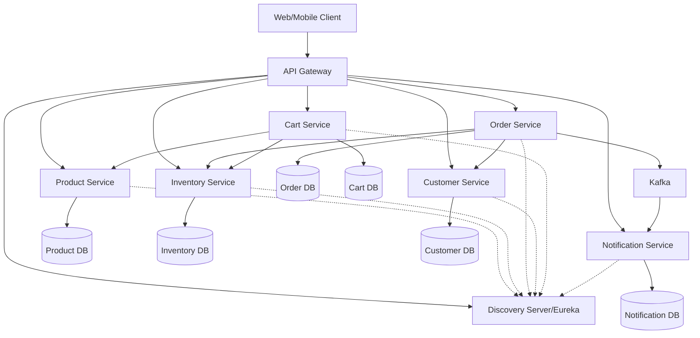
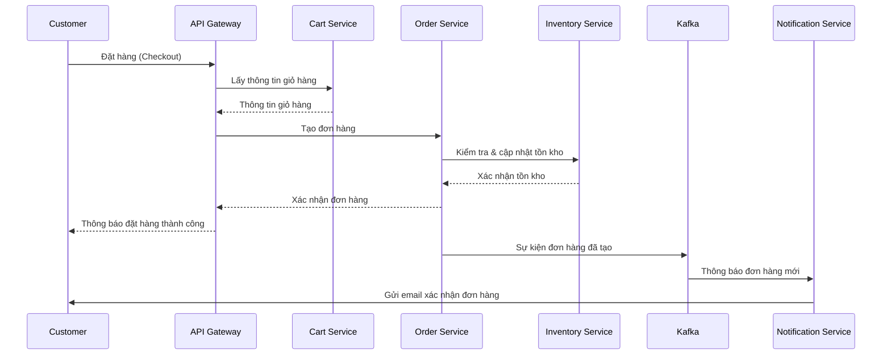

# 📄 Kiến Trúc Hệ Thống – Hệ Thống Đặt hàng Theo Kiến Trúc Microservices

---

## 1. Tổng Quan

### Mục đích của hệ thống microservices

Hệ thống Đặt hàng được xây dựng theo kiến trúc Microservices nhằm phục vụ nhu cầu mua sắm trực tuyến với khả năng xử lý lượng lớn người dùng, sản phẩm và đơn hàng. Việc áp dụng kiến trúc *Microservices* mang lại nhiều lợi ích vượt trội như: khả năng mở rộng linh hoạt, triển khai độc lập từng thành phần, dễ bảo trì và tích hợp với các hệ thống thanh toán, vận chuyển bên ngoài.

Mỗi dịch vụ sẽ chịu trách nhiệm cho một chức năng duy nhất, tuân thủ nguyên tắc *Single Responsibility* và đảm bảo khả năng *mở rộng theo chiều ngang*.

### Các thành phần chính và chức năng

| Thành phần                   | Chức năng chính                                                                                |
| ---------------------------- | ---------------------------------------------------------------------------------------------- |
| *Discovery Server (Eureka)* | Đăng ký và phát hiện các dịch vụ, cho phép các dịch vụ tìm kiếm và giao tiếp với nhau. |
| *API Gateway*              | Cửa ngõ duy nhất của hệ thống, tiếp nhận và định tuyến các yêu cầu đến từng service thích hợp. |
| *Product Service*          | Quản lý thông tin sản phẩm, danh mục, giá cả và hình ảnh. |
| *Inventory Service*        | Quản lý tồn kho, cập nhật số lượng khi có đơn hàng mới. |
| *Order Service*            | Xử lý đơn hàng, từ tạo đơn đến các trạng thái xử lý. |
| *Customer Service*         | Quản lý thông tin khách hàng, tài khoản, địa chỉ giao hàng. |
| *Cart Service*             | Quản lý giỏ hàng của người dùng. |
| *Notification Service*     | Gửi thông báo đến khách hàng qua email hoặc các kênh khác. |
| *MySQL Database*           | Mỗi service có cơ sở dữ liệu MySQL riêng biệt, đảm bảo tính phân tách dữ liệu. |

---

## 2. Các Thành Phần Hệ Thống

### 2.1. Discovery Server (Eureka)

- Đăng ký các dịch vụ khi chúng khởi động.
- Cho phép các dịch vụ tìm kiếm và giao tiếp với nhau.
- Theo dõi trạng thái hoạt động (health) của các dịch vụ.
- Cung cấp cơ chế cân bằng tải (load balancing) đơn giản.

### 2.2. API Gateway

- Đóng vai trò là điểm vào duy nhất cho tất cả các yêu cầu từ client.
- Định tuyến các yêu cầu HTTP đến các microservice phù hợp.
- Xử lý xác thực và ủy quyền người dùng.
- Thực hiện bảo mật, giới hạn tỷ lệ (rate limiting) và ghi nhật ký.
- Tích hợp với Discovery Server để định tuyến động.

### 2.3. Product Service

- Quản lý danh mục sản phẩm và thông tin chi tiết.
- Cung cấp API để tìm kiếm, lọc và hiển thị sản phẩm.
- Xử lý hình ảnh sản phẩm và thuộc tính sản phẩm.
- Cập nhật thông tin sản phẩm như giá, mô tả, đặc điểm.

### 2.4. Inventory Service

- Theo dõi số lượng tồn kho của từng sản phẩm.
- Cập nhật số lượng khi có đơn hàng mới hoặc hoàn trả.
- Cảnh báo khi hàng sắp hết.
- Giao tiếp với Order Service để đảm bảo chỉ bán sản phẩm có sẵn.

### 2.5. Order Service

- Xử lý việc tạo và quản lý đơn hàng.
- Cập nhật trạng thái đơn hàng trong suốt quy trình.
- Tính toán giá, thuế và chi phí vận chuyển.
- Gửi thông báo đến Notification Service khi trạng thái đơn hàng thay đổi.
- Giao tiếp với Inventory Service để cập nhật tồn kho.

### 2.6. Customer Service

- Quản lý thông tin người dùng, hồ sơ và xác thực.
- Lưu trữ địa chỉ giao hàng và thông tin thanh toán.
- Xử lý đăng ký, đăng nhập và quản lý phiên.
- Theo dõi lịch sử đơn hàng của khách hàng.

### 2.7. Cart Service

- Quản lý giỏ hàng cho người dùng đã đăng nhập và chưa đăng nhập.
- Thêm, cập nhật và xóa sản phẩm trong giỏ hàng.
- Tính toán tổng giá trị giỏ hàng.
- Chuyển đổi giỏ hàng thành đơn hàng.

### 2.8. Notification Service

- Gửi email xác nhận đơn hàng, cập nhật trạng thái.
- Thông báo về giảm giá, khuyến mãi và sản phẩm mới.
- Lưu trữ mẫu thông báo và lịch sử gửi.
- Xử lý hàng đợi thông báo để đảm bảo độ tin cậy.

### 2.9. Cơ sở dữ liệu MySQL

| Dịch vụ | Cơ sở dữ liệu | Nội dung lưu trữ |
| ------- | ------------- | ---------------- |
| Product Service | product-db | Thông tin sản phẩm, danh mục, giá cả, hình ảnh |
| Inventory Service | inventory-db | Số lượng tồn kho, thay đổi tồn kho, vị trí |
| Order Service | order-db | Đơn hàng, chi tiết đơn hàng, trạng thái, lịch sử |
| Customer Service | customer-db | Thông tin khách hàng, tài khoản, địa chỉ |
| Cart Service | cart-db | Giỏ hàng, sản phẩm trong giỏ, số lượng |
| Notification Service | notification-db | Mẫu thông báo, lịch sử gửi, trạng thái |

---

## 3. Giao Tiếp

### 3.1. Giao tiếp giữa các dịch vụ

- Các dịch vụ giao tiếp chủ yếu thông qua *HTTP REST API*.
- Tất cả request từ client đều đi qua API Gateway để đảm bảo khả năng kiểm soát và giám sát tập trung.
- Giao tiếp không đồng bộ giữa Order Service và Notification Service thông qua *Apache Kafka*.
- Discovery Server (Eureka) giúp các service tìm thấy nhau mà không cần biết IP tĩnh.

### 3.2. API và Endpoints

- Mỗi service cung cấp các RESTful API với định dạng JSON.
- API Gateway xác thực và định tuyến requests.
- Các endpoints được ghi chép đầy đủ theo chuẩn OpenAPI/Swagger.

### 3.3. Tính bảo mật và tin cậy

- JWT (JSON Web Token) cho xác thực và ủy quyền.
- HTTPS cho tất cả các kết nối.
- Giới hạn tỷ lệ truy cập (Rate limiting) để ngăn chặn tấn công DDoS.
- Circuit breaker để xử lý lỗi dịch vụ và tăng khả năng phục hồi.

---

## 4. Luồng Dữ Liệu

### 4.1. Luồng xử lý chính:

1. Khách hàng truy cập hệ thống thông qua Web/Mobile App.
2. Yêu cầu được gửi đến API Gateway, xác thực và định tuyến đến service phù hợp.
3. **Duyệt và Tìm kiếm sản phẩm:**
   - API Gateway → Product Service → Hiển thị sản phẩm cho khách hàng.
4. **Thêm vào giỏ hàng:**
   - API Gateway → Cart Service → Cập nhật giỏ hàng.
   - Cart Service → Product Service → Kiểm tra thông tin sản phẩm.
   - Cart Service → Inventory Service → Kiểm tra tồn kho.
5. **Đặt hàng:**
   - API Gateway → Order Service → Tạo đơn hàng mới.
   - Order Service → Customer Service → Xác nhận thông tin khách hàng.
   - Order Service → Inventory Service → Cập nhật tồn kho.
   - Order Service → Kafka → Notification Service → Gửi email xác nhận đơn hàng.
6. **Theo dõi đơn hàng:**
   - API Gateway → Order Service → Truy vấn trạng thái đơn hàng.
   - Order Service → Notification Service → Thông báo cập nhật trạng thái.

### 4.2. Xử lý dữ liệu không đồng bộ

- Kafka xử lý giao tiếp không đồng bộ giữa Order Service và Notification Service.
- Event-driven architecture cho các thay đổi trạng thái đơn hàng.
- Retry mechanism cho các thao tác quan trọng như cập nhật tồn kho.

---

## 5. Sơ Đồ

### 5.1. Sơ đồ kiến trúc tổng thể

### 5.2. Luồng xử lý đơn hàng

---

## 6. Khả Năng Mở Rộng & Chịu Lỗi

### 6.1. Khả năng mở rộng

- *Scale theo chiều ngang* bằng cách nhân bản từng service.
- Cân bằng tải (load balancing) qua Eureka và Spring Cloud.
- Sharding cơ sở dữ liệu cho các dịch vụ xử lý dữ liệu lớn (như Product, Order).
- Caching với Redis để giảm tải truy vấn DB cho các dữ liệu thường xuyên đọc.

### 6.2. Chịu lỗi và xử lý lỗi

- *Circuit Breaker* pattern (Hystrix/Resilience4j) để ngăn cascade failures.
- Retry mechanisms cho các thao tác quan trọng.
- Health checks và tự động khôi phục dịch vụ.
- Distributed tracing để theo dõi và gỡ lỗi requests xuyên suốt hệ thống.
- Fallback strategies khi dịch vụ không khả dụng.

---

## 7. Kết Luận

Kiến trúc microservices trong hệ thống Đặt hàng không chỉ giúp quản lý dữ liệu hiệu quả, mà còn đảm bảo tính mở rộng, khả năng phục vụ số lượng lớn người dùng đồng thời và đáp ứng nhanh với thay đổi thị trường. Việc phân tách chức năng rõ ràng, kết hợp với các công nghệ hiện đại như Spring Cloud, Eureka, Kafka và các tiêu chuẩn giao tiếp RESTful, giúp hệ thống vận hành ổn định, dễ bảo trì và phát triển trong tương lai. 