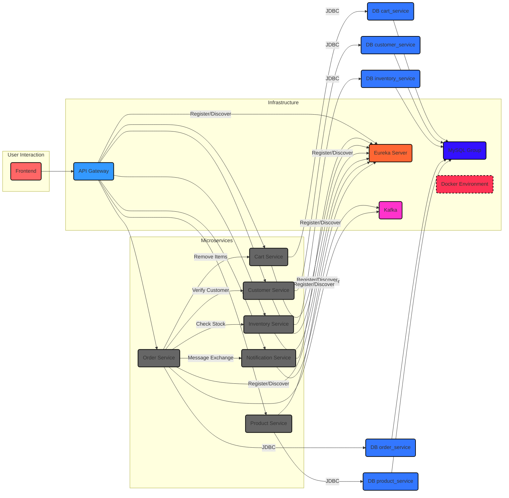
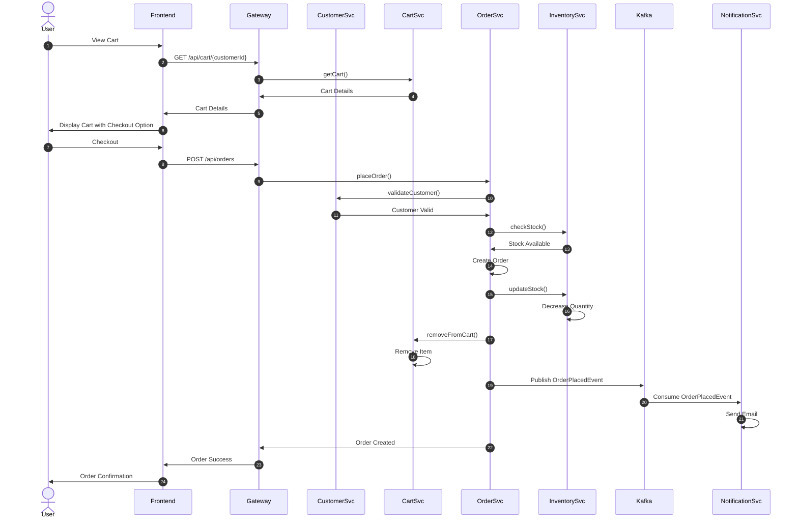

# System Architecture

## Overview
Hệ thống Microservices Đặt Hàng được thiết kế để quản lý toàn bộ quy trình từ xem sản phẩm, thêm vào giỏ hàng, đặt hàng đến gửi thông báo xác nhận đơn hàng. Kiến trúc phân tán giúp tăng tính sẵn sàng, độc lập triển khai và khả năng mở rộng cho từng thành phần chức năng.

Mỗi microservice được phát triển và triển khai độc lập, có cơ sở dữ liệu riêng, và giao tiếp với nhau thông qua REST API hoặc messaging (Kafka).

## System Components
- **Discovery Server**: Eureka Server đóng vai trò đăng ký và khám phá dịch vụ, giúp các microservice tìm thấy nhau trong hệ thống phân tán.

- **API Gateway**: Điểm vào duy nhất cho tất cả các yêu cầu từ client, chịu trách nhiệm định tuyến đến các dịch vụ phù hợp, cân bằng tải và bảo mật.

- **Product Service**: Quản lý thông tin sản phẩm, bao gồm tên, mô tả, giá, mã sản phẩm.

- **Inventory Service**: Quản lý tồn kho sản phẩm, kiểm tra và cập nhật số lượng tồn kho.

- **Order Service**: Xử lý đơn hàng, kiểm tra tồn kho và thông tin khách hàng trước khi tạo đơn hàng, phát sự kiện khi đơn hàng được tạo.

- **Customer Service**: Quản lý thông tin khách hàng, xác thực và cung cấp API xác thực cho các service khác.

- **Cart Service**: Quản lý giỏ hàng của khách hàng, thêm/xóa sản phẩm vào giỏ hàng.

- **Notification Service**: Nhận sự kiện đơn hàng từ Kafka và gửi email thông báo cho khách hàng.

## Communication
- **Đồng bộ**: Các service giao tiếp với nhau thông qua REST API sử dụng Spring Cloud OpenFeign client.
  - Order Service gọi đến Customer Service để xác thực khách hàng
  - Order Service gọi đến Inventory Service để kiểm tra tồn kho
  - Order Service gọi đến Cart Service để xóa sản phẩm khỏi giỏ hàng sau khi đặt hàng

- **Bất đồng bộ**: Sử dụng Kafka để giao tiếp không đồng bộ, giúp giảm sự phụ thuộc trực tiếp giữa các service.
  - Order Service phát sự kiện "order-events" khi đơn hàng được tạo
  - Notification Service đăng ký nhận sự kiện "order-events" để gửi email thông báo

- **Service Discovery**: Tất cả các service đăng ký với Eureka Server, giúp các service tự động tìm thấy nhau thông qua tên service mà không cần biết địa chỉ IP/Port cụ thể.

## Data Flow
1. **Đặt hàng**:
   - Client gửi request đặt hàng qua API Gateway
   - API Gateway chuyển request đến Order Service
   - Order Service kiểm tra thông tin khách hàng qua Customer Service
   - Order Service kiểm tra tồn kho qua Inventory Service
   - Nếu hợp lệ, Order Service lưu đơn hàng và phát sự kiện qua Kafka
   - Order Service yêu cầu Cart Service xóa sản phẩm khỏi giỏ hàng
   - Notification Service nhận sự kiện và gửi email xác nhận đơn hàng

2. **Quản lý giỏ hàng**:
   - Client gửi request thêm sản phẩm vào giỏ hàng qua API Gateway
   - API Gateway chuyển request đến Cart Service
   - Cart Service lưu thông tin sản phẩm vào giỏ hàng của khách hàng

3. **Quản lý sản phẩm**:
   - Admin thêm/sửa/xóa sản phẩm qua Product Service
   - Inventory Service cập nhật thông tin tồn kho tương ứng

## Sơ đồ

## Scalability & Fault Tolerance
- **Horizontally Scalable**: Mỗi microservice có thể được mở rộng độc lập bằng cách tăng số lượng instance dựa trên tải hệ thống. Eureka Server tự động phát hiện các instance mới.

- **Fault Isolation**: Lỗi trong một service không ảnh hưởng đến toàn bộ hệ thống. Ví dụ, nếu Notification Service gặp sự cố, các đơn hàng vẫn được xử lý bình thường.

- **Eventual Consistency**: Sử dụng mô hình nhất quán cuối cùng qua Kafka giúp hệ thống vẫn hoạt động khi có service bị lỗi tạm thời.

- **Database Per Service**: Mỗi service có cơ sở dữ liệu riêng, giảm thiểu điểm lỗi chung và tăng khả năng mở rộng.

- **API Gateway**: Cung cấp các tính năng như rate limiting, circuit breaking để bảo vệ các service khỏi quá tải.
